# ZAGREBALLER

ZagreBaller is the ultimate app for futsal enthusiasts. Connect with players, organize games, and join local futsal events. Find your team, challenge opponents, and play the game you love with ease!

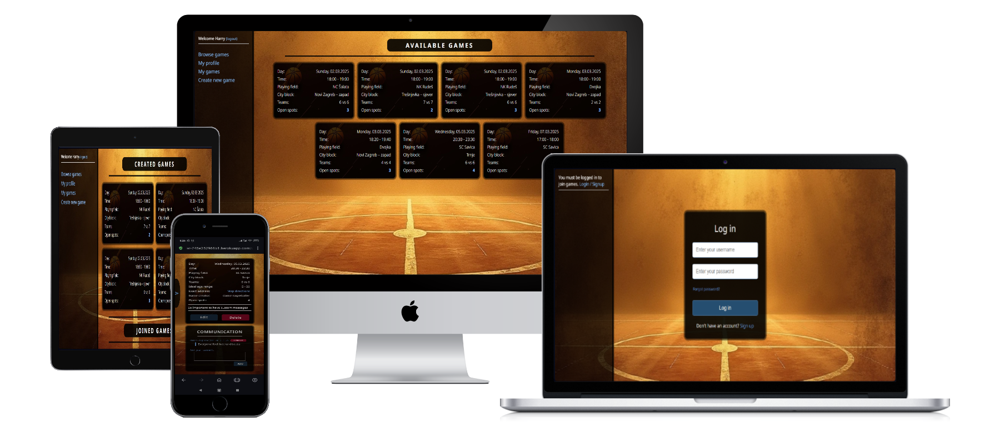

# PROJECT IDEA AND TARGET

Project idea is to create an online platform dedicated to connecting futsal players, enabling them to organize games, join local events, and engage with a community of like-minded sports enthusiasts. It aims to simplify the process of finding futsal players and venues, fostering better access to recreational and competitive futsal opportunities. In addition, it serves as a great entry point for newcomers to the city to quickly find teams. Idea is based on a real need in my city and I'm proud to say it resulted in connecting a young Korean group to their first game even during research phase! Information gathered was organized into user stories with a noticed strong notion that the system needs to be fast and simple with no elaborate social media-like features.

## USER STORIES BASED APPROACH

### Epic: User profile management

**User story 1: User account creation and login**  
As a new user, I want to create an account and log in to the platform, so that I can access my personal player profile and interact with the community.

**ACCEPTANCE CRITERIA:**
- A sign-up page where users can create an account with basic information (name, email, password).
- A login page where existing users can authenticate using their credentials.
---

**User story 2: View and edit player profile**  
As a logged-in user, I want to view and edit my personal player profile, so that new people can know my basic information

**ACCEPTANCE CRITERIA:**
- A user profile page that displays basic player information
- The ability to update personal information such as email, profile picture
- The ability to save changes after updating the profile.

---

### Epic: Game management

**User story 3: Create a game**  
As a user, I want to create a game with specific details (date, time, location, team size), so that I can invite others to join and organize futsal games.

**ACCEPTANCE CRITERIA:**
- A game creation form that allows the user to input relevant details
- The ability to set the number of players required for each team and total players.

---

**User story 4: Join an existing game**  
As a user, I want to browse available games and join one, so that I can participate in futsal games in my area.

**ACCEPTANCE CRITERIA:**
- A list of available games
- The ability to join a game with a simple click, showing confirmation of the action.
- A notification or confirmation message once the user has successfully joined a game.

---

**User story 5: Update a game**  
As a game creator, I want to edit the game details, so that I can adjust the game to reflect any changes.

**ACCEPTANCE CRITERIA:**
- A functionality that allows the game creator to update existing game details.

---

**User story 6: Delete a game**  
As a game creator, I want to delete a game I created, so that it is removed from the platform if necessary.

**ACCEPTANCE CRITERIA:**
- An option for the game creator to delete the game.
- A confirmation prompt before the game is deleted to avoid accidental deletions.

---

### Epic: Communication & messaging

**User story 7: In-game messaging system**  
As a user who joined a game, I want to send and receive messages within the game group, so that I can communicate with other players for additional information (e.g., changes, meeting points).

**ACCEPTANCE CRITERIA:**
- A messaging feature available for users who joined the same game.
- Immediately see added message or that it was removed.

---

### Epic: Game instance management

**User story 8: View game details**  
As a user, I want to view the game details, so that I can know where and when the game is happening.

**ACCEPTANCE CRITERIA:**
- A detailed game instance page displaying all relevant information (date, time, playing field, location, team size).
- The option to join or leave the game from the game details page.

---

**User story 9: Track joined games**  
As a user, I want to see all the games I have joined or created, so that I can keep track of my upcoming games and activities.

**ACCEPTANCE CRITERIA:**
- A list of all games user is a part of
- A clear distinction between games the user has joined and games they have created.

# DATA MODEL
Once again used pen and paper for drawing and came up with the generated model below. There were no changes to the idea of the model or fields made throughout the whole project. Some changes were made to fit django implementation.

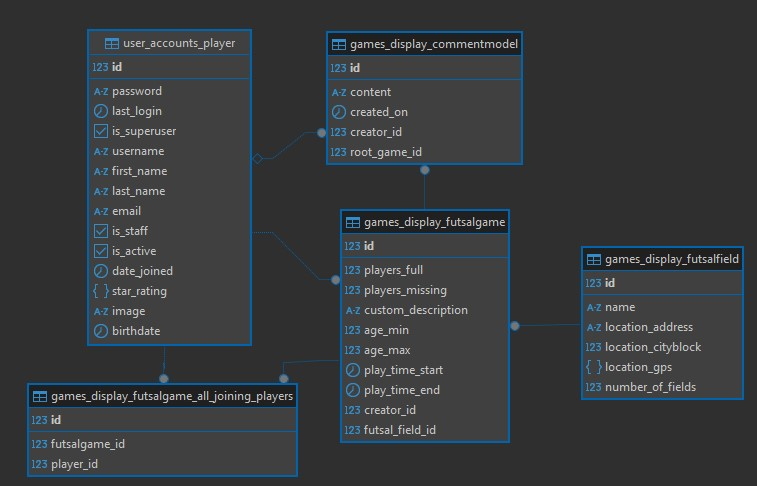

# UX DESIGN

Following the notion of making a simple, fast and direct system and realizing most players would be using phones to browse and join I've decided to organize games into cards and display them below each other with larger screens utilizing extra width to display them in rows. Easy with flexbox! Information shown will contain date, time, name of the arena, CITY BLOCK of the arena as newcomers to city would love to see that. It's followed by total players and a number of open spots. The crucial information and nothing more! On touching one of the cards extra information is shown and functionality to join displayed with a link to exact google maps location available. Forms for inputting data are simple, mobile-friendly, choice based and pre-filled with most popular options (like the date being today or team size of 6). Theme is to be vibrant background and darker elements with light text. Honestly because i personally like it. :)

Just like for user stories I've used pen and paper to visualize the simple idea

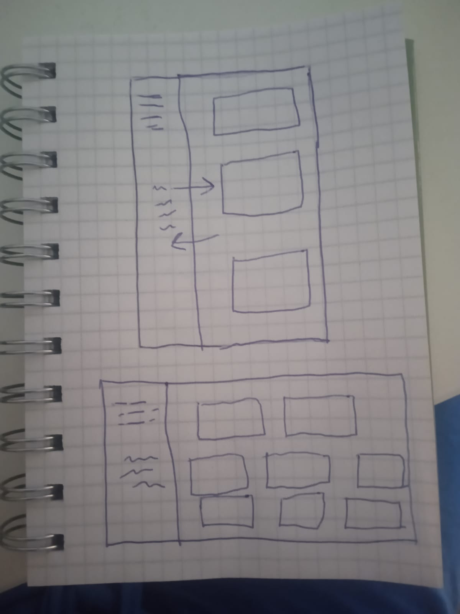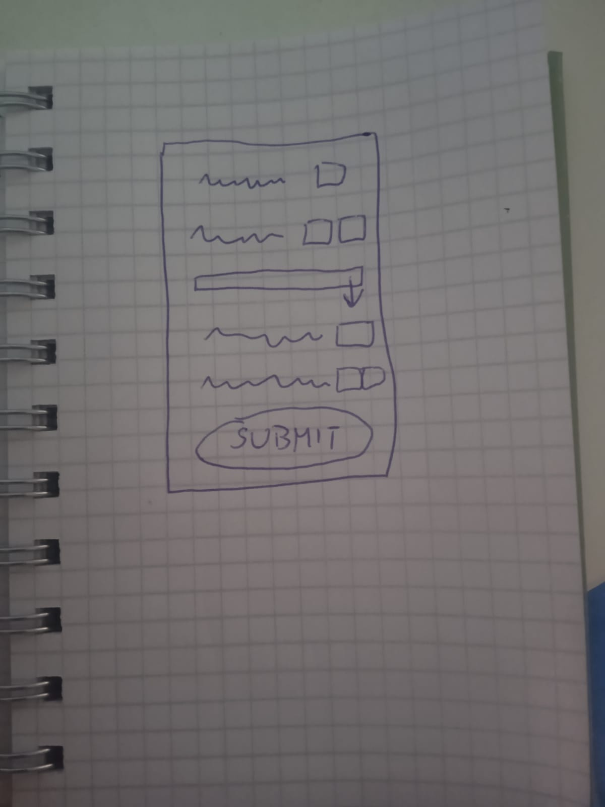

However, I've used AI to generate background images and Coolors website to match colors to it. Links in credits section

# FEATURES

## LANDING FOR THE FIRST TIME - BROWSE AND SIDEBAR FEATURES

The first thing you see when seeing the page first time is available game list. This is with intention to let you see you can join a game and how clear the information is! What you have is a BROWSING feature that lists all available games sorted by start date.

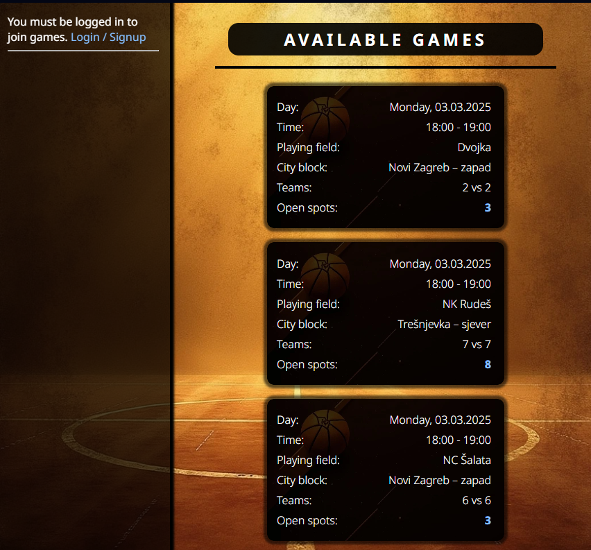

On mobile devices you will see a collapsable sidebar-type menu and larger screens will have it on full time. Includes a neat sliding animation as well

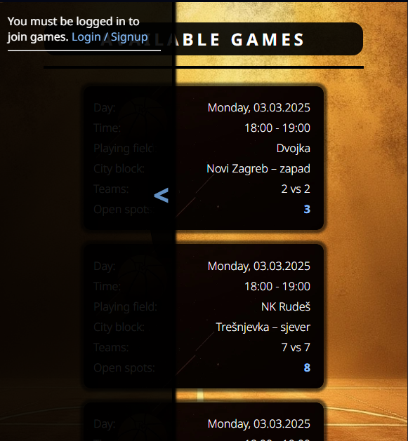
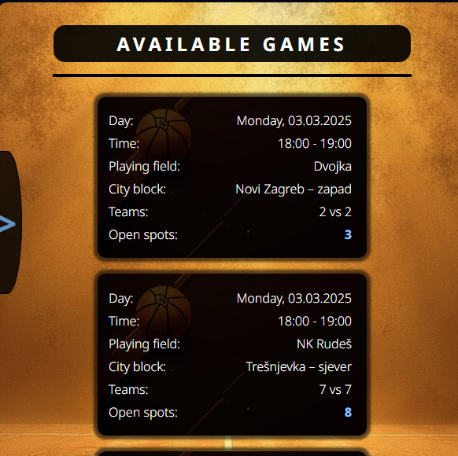

In addition to having a clear instruction to login on the sidebar, any further actions you take will lead to the next feature

## LOGIN AND INFO-MESSAGE FEATURES

To use the website you need to be a user and login so it's only natural to have a pretty theme-fitting login menu. It also doubles as access to signup menu

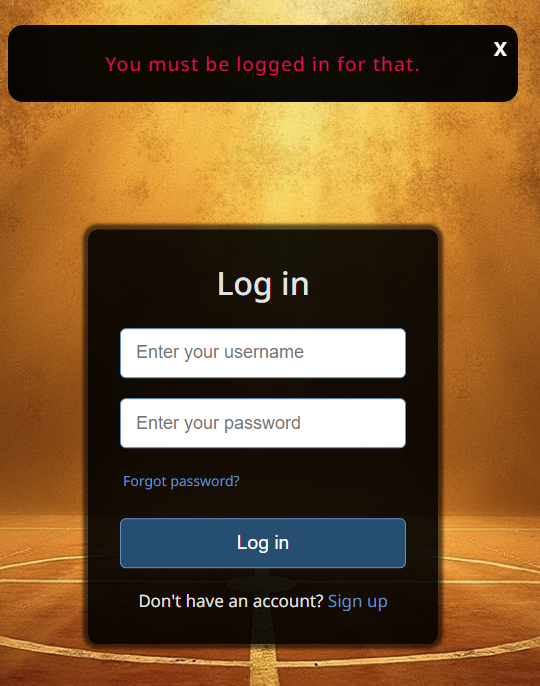

In case you're coming from other places on website you'll already be introduced to the info-message feature like above. It pops up on top of the screen and let's you know what happened. It is persistent and consistent throughout the entire app.

### SIGNUP

Now you realized you need to signup, so let's do that, it's super simple and fast just like research says players want it. You will get reacquainted with message-info feature if anything is going wrongly here.

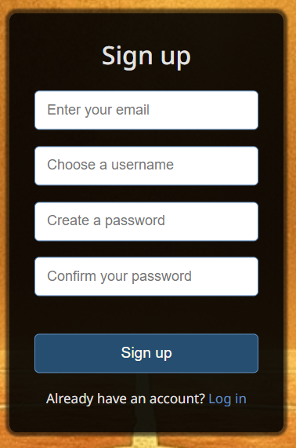

### NAVIGATION AND LOGOUT FEATURES

After signing up and logging in you will see the true usability of the sidebar feature as a navigational element and indicator if you're logged in. It also has a self-explanatory logout feature

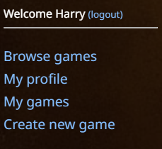

### USER PROFILE EDIT

You can use the sidebar to now access this feature. Simple and easy form allows you to add your name, email and date of birth and also choose your profile picture.

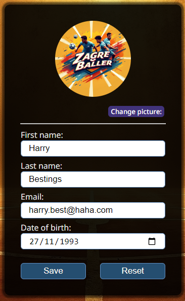

Trying to save the changes brings us to the next feature

### CONFIRMATION DIALOG

Every action on the site that has a significant effect on your experience or affects other users will be prevented from happening on accident by this simple but effective dialogue

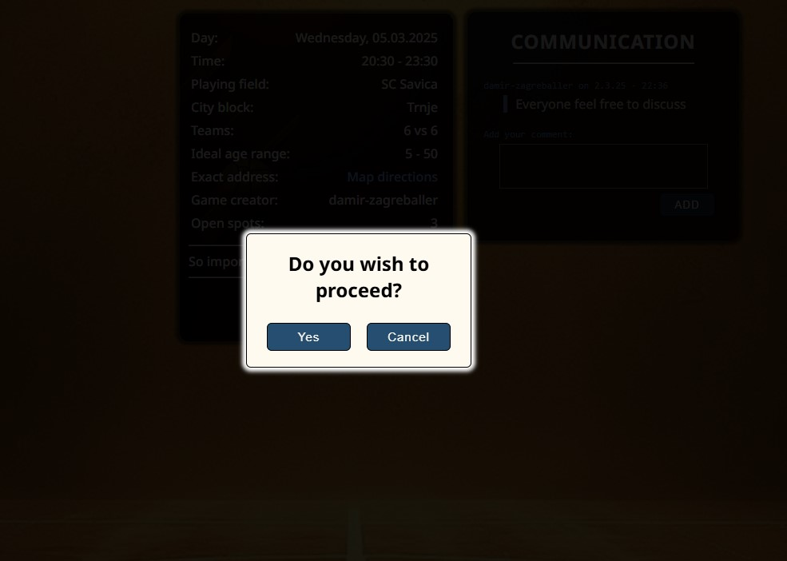

### GAME CARD

Your info is fully set up! Let's look at some games - unless you're already there of course, this is enabled on purpose for speed. What you see is a game card showing you exactly the information you need to know and nothing more or less.

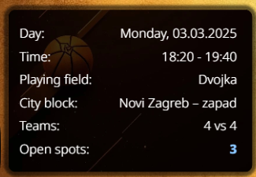

It also acts as a link to see game details and possibly join the game

### DETAIL AND JOINING GAME FEATURES

This card has the same structure as the original game card but gives you extra information, creator's notes and even a link to exact game arena location on google maps. Those pins are set at the door coordinates. It also allows you to join a game

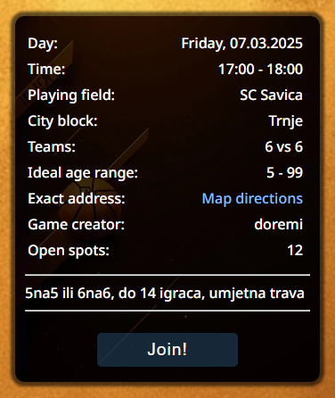

Joining the game is super easy, just click on the obvious button and confirm it with the dialogue feature

### MESSAGES

Upon joining access to messages related to this game is available. Feature includes the ability to add or remove your own messages for any questions or discussions prior to game start. Connect with the creator!

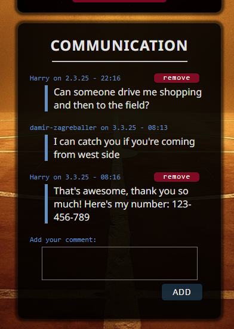

### LEAVING GAME

Detailed display will also allow you to leave the game (with confirmation of course)

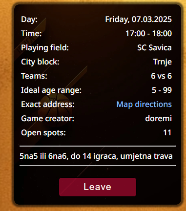

### CREATE GAME

Since you know that one isn't for you let's create one with you and your friends. On the navigation go to create game and you'll get this super simple form to use

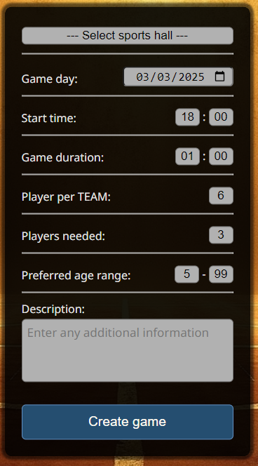

All fields are pre-filled with ready options so if you're starting a 6v6 game today from 18-19h and need 3 more players (not caring about ages at all), simply select the location from drop-down list and click create. Confirm with dialogue and you're done! Doesn't get faster than that. In case you'd like to change it a bit - all options are selectable and you can even add additional information.

### EDIT GAME

After creating a game you'll end up in it's detailed view just to be sure everything is fine and here you'll see that it now offers you edit and delete options.

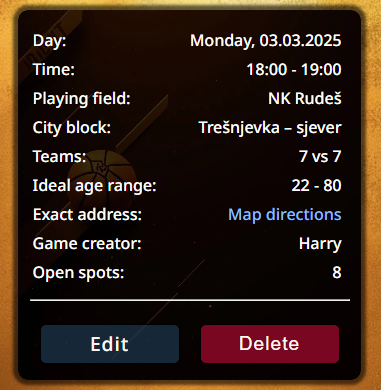

Realizing you'll actually be starting an hour later than shown, you click on edit button and end up in the good old game creation form with all your previous data pre-filled, ready to be changed to correct and a "save changes" button just to be sure we're not creating a different game. Confirm the action and you're done.

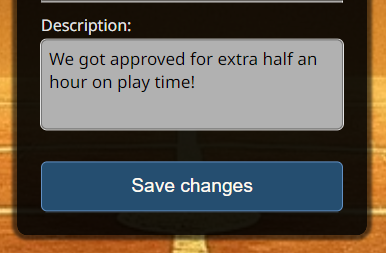

### DELETE GAME

Now you're back in newly edited game's detailed view and have the option to delete it since three of your friends cancelled and you don't feel like looking for 6 more players in the next 40 minutes. No problem, just use the delete button, confirm the action and you're done. Start looking for players earlier next time :)

### MY GAMES

Ther is one more option on the sidebar after you've created next week's games and left for the day. It's waiting for your return and readily shows you all the games you've created and joined to easily organize yourself. My games gives you exactly this.

# CREDITS

- I've copied the code and later edited it a bit while using this tutorial to create a custom user model in django: [Tutorial used](https://learndjango.com/tutorials/django-custom-user-model)
- I've copied the code for login/signup two in one form and used it significantly on other elements of page after changing from this source: [Source for login form](https://www.codingnepalweb.com/create-login-registration-form-html-css/)
- To generate images [Leonardo AI](https://app.leonardo.ai/) was used
- To fix database - django interaction by running SQL queries directly I used [DBeaver](https://dbeaver.io/)
- To remind myself of html/css and research options [W3Schools](https://www.w3schools.com/) and [MDN Docs](https://developer.mozilla.org/en-US/docs/Web/CSS) were a great source
- By far the biggest source of information and time spent on reading and research was [official django documentation](https://docs.djangoproject.com/en/5.1/)
- I've used [chatGPT](https://chatgpt.com/) to generate generic user stories before starting the project and its response has affected my design and approach
- To get fitting colors after settling on my background I used [coolors](https://coolors.co/c2efb3-97abb1-746f72-735f3d-594a26)
- AI generated images were converted to .webp format using [freeconvert](https://www.freeconvert.com/)

# TO STRUCTURE MENTIONS LATER
- Y Sheet App https://app.ysheet.com/
- sendgrid https://app.sendgrid.com/
- chat gpt sheet to markdown
- pep257 https://peps.python.org/pep-0257/